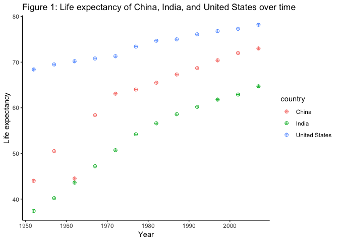

STAT545\_hw04\_exploration
================

# Homework 04

#### Author: Bassam Javed (github.com: *bassamjaved*)

The following packages are required:

``` r
library(gapminder)
library(tidyverse)
```

    ## ── Attaching packages ─────────────────────────────────────────────────────────── tidyverse 1.2.1 ──

    ## ✔ ggplot2 3.0.0     ✔ purrr   0.2.5
    ## ✔ tibble  1.4.2     ✔ dplyr   0.7.6
    ## ✔ tidyr   0.8.1     ✔ stringr 1.3.1
    ## ✔ readr   1.1.1     ✔ forcats 0.3.0

    ## ── Conflicts ────────────────────────────────────────────────────────────── tidyverse_conflicts() ──
    ## ✖ dplyr::filter() masks stats::filter()
    ## ✖ dplyr::lag()    masks stats::lag()

``` r
library(knitr)
library(kableExtra)
```

## Data Reshaping Prompts

### Activity \#2

**Make a tibble with one row per year and columns for life expectancy
for two or more countries.**

*Preamble*: I spread gapminder data by country to observe values for
life expectancy. For simplicity, I use United States, India and
China.

``` r
A <- filter(gapminder, country == "United States" | country == "India" | country == "China") %>% 
  mutate(lifeExp = round(lifeExp, 1)) %>% #Round to one digit for readability
  transmute(country, year, lifeExp) #Remove columns not wanted for this analysis

spread(A, key = "country", value = "lifeExp" ) %>% #Spread A by country with values of lifeExp
  kable(caption = "Table 1: Life expectancy of China, India, and United States over time") %>% 
  kable_styling(full_width = FALSE, bootstrap_options = "striped", position = "center") %>% 
   add_header_above(c(" " = 1, "Country" = 3)) #Add header groupings. Value is column width.
```

<table class="table table-striped" style="width: auto !important; margin-left: auto; margin-right: auto;">

<caption>

Table 1: Life expectancy of China, India, and United States over
time

</caption>

<thead>

<tr>

<th style="border-bottom:hidden" colspan="1">

</th>

<th style="border-bottom:hidden; padding-bottom:0; padding-left:3px;padding-right:3px;text-align: center; " colspan="3">

<div style="border-bottom: 1px solid #ddd; padding-bottom: 5px;">

Country

</div>

</th>

</tr>

<tr>

<th style="text-align:right;">

year

</th>

<th style="text-align:right;">

China

</th>

<th style="text-align:right;">

India

</th>

<th style="text-align:right;">

United States

</th>

</tr>

</thead>

<tbody>

<tr>

<td style="text-align:right;">

1952

</td>

<td style="text-align:right;">

44.0

</td>

<td style="text-align:right;">

37.4

</td>

<td style="text-align:right;">

68.4

</td>

</tr>

<tr>

<td style="text-align:right;">

1957

</td>

<td style="text-align:right;">

50.5

</td>

<td style="text-align:right;">

40.2

</td>

<td style="text-align:right;">

69.5

</td>

</tr>

<tr>

<td style="text-align:right;">

1962

</td>

<td style="text-align:right;">

44.5

</td>

<td style="text-align:right;">

43.6

</td>

<td style="text-align:right;">

70.2

</td>

</tr>

<tr>

<td style="text-align:right;">

1967

</td>

<td style="text-align:right;">

58.4

</td>

<td style="text-align:right;">

47.2

</td>

<td style="text-align:right;">

70.8

</td>

</tr>

<tr>

<td style="text-align:right;">

1972

</td>

<td style="text-align:right;">

63.1

</td>

<td style="text-align:right;">

50.7

</td>

<td style="text-align:right;">

71.3

</td>

</tr>

<tr>

<td style="text-align:right;">

1977

</td>

<td style="text-align:right;">

64.0

</td>

<td style="text-align:right;">

54.2

</td>

<td style="text-align:right;">

73.4

</td>

</tr>

<tr>

<td style="text-align:right;">

1982

</td>

<td style="text-align:right;">

65.5

</td>

<td style="text-align:right;">

56.6

</td>

<td style="text-align:right;">

74.7

</td>

</tr>

<tr>

<td style="text-align:right;">

1987

</td>

<td style="text-align:right;">

67.3

</td>

<td style="text-align:right;">

58.6

</td>

<td style="text-align:right;">

75.0

</td>

</tr>

<tr>

<td style="text-align:right;">

1992

</td>

<td style="text-align:right;">

68.7

</td>

<td style="text-align:right;">

60.2

</td>

<td style="text-align:right;">

76.1

</td>

</tr>

<tr>

<td style="text-align:right;">

1997

</td>

<td style="text-align:right;">

70.4

</td>

<td style="text-align:right;">

61.8

</td>

<td style="text-align:right;">

76.8

</td>

</tr>

<tr>

<td style="text-align:right;">

2002

</td>

<td style="text-align:right;">

72.0

</td>

<td style="text-align:right;">

62.9

</td>

<td style="text-align:right;">

77.3

</td>

</tr>

<tr>

<td style="text-align:right;">

2007

</td>

<td style="text-align:right;">

73.0

</td>

<td style="text-align:right;">

64.7

</td>

<td style="text-align:right;">

78.2

</td>

</tr>

</tbody>

</table>

``` r
ggplot(A, aes(year, lifeExp)) + 
  geom_point(aes(colour = country), shape = 10, size = 2) +
  theme_classic() +
  labs(title = "Figure 1: Life expectancy of China, India, and United States over time", 
       x = "Year", 
       y = "Life expectancy")
```

<!-- -->

*Comments*: Using the newly created tibble A, it is easier to create the
desired figure with ggplot since the data is already in the desired tidy
form. There is no need to group the gapminder data by country and pass
it into ggplot as this is already complete in A.

### Activity \#3

**Compute some measure of life expectancy (mean? median? min? max?) for
all possible combinations of continent and year. Reshape that to have
one row per year and one variable for each continent.**

*Preamble*: First, I create a new tibble B from gapminder that stores
the mean of life expectancy, grouped by continent. I then spread B by
continent to observe values for mean life expectancy.

``` r
B <- gapminder %>% 
  group_by(continent, year) %>% 
  summarize(mu = round(mean(lifeExp),1))

spread(B, key = "continent", value = "mu") %>% 
  kable(caption = "Table 2: Mean life expectancy over time") %>% 
  kable_styling(full_width = FALSE, bootstrap_options = "striped", position = "center") %>% 
   add_header_above(c(" " = 1, "Continent" = 5)) #Add header groupings. Value is column width.
```

<table class="table table-striped" style="width: auto !important; margin-left: auto; margin-right: auto;">

<caption>

Table 2: Mean life expectancy over
time

</caption>

<thead>

<tr>

<th style="border-bottom:hidden" colspan="1">

</th>

<th style="border-bottom:hidden; padding-bottom:0; padding-left:3px;padding-right:3px;text-align: center; " colspan="5">

<div style="border-bottom: 1px solid #ddd; padding-bottom: 5px;">

Continent

</div>

</th>

</tr>

<tr>

<th style="text-align:right;">

year

</th>

<th style="text-align:right;">

Africa

</th>

<th style="text-align:right;">

Americas

</th>

<th style="text-align:right;">

Asia

</th>

<th style="text-align:right;">

Europe

</th>

<th style="text-align:right;">

Oceania

</th>

</tr>

</thead>

<tbody>

<tr>

<td style="text-align:right;">

1952

</td>

<td style="text-align:right;">

39.1

</td>

<td style="text-align:right;">

53.3

</td>

<td style="text-align:right;">

46.3

</td>

<td style="text-align:right;">

64.4

</td>

<td style="text-align:right;">

69.3

</td>

</tr>

<tr>

<td style="text-align:right;">

1957

</td>

<td style="text-align:right;">

41.3

</td>

<td style="text-align:right;">

56.0

</td>

<td style="text-align:right;">

49.3

</td>

<td style="text-align:right;">

66.7

</td>

<td style="text-align:right;">

70.3

</td>

</tr>

<tr>

<td style="text-align:right;">

1962

</td>

<td style="text-align:right;">

43.3

</td>

<td style="text-align:right;">

58.4

</td>

<td style="text-align:right;">

51.6

</td>

<td style="text-align:right;">

68.5

</td>

<td style="text-align:right;">

71.1

</td>

</tr>

<tr>

<td style="text-align:right;">

1967

</td>

<td style="text-align:right;">

45.3

</td>

<td style="text-align:right;">

60.4

</td>

<td style="text-align:right;">

54.7

</td>

<td style="text-align:right;">

69.7

</td>

<td style="text-align:right;">

71.3

</td>

</tr>

<tr>

<td style="text-align:right;">

1972

</td>

<td style="text-align:right;">

47.5

</td>

<td style="text-align:right;">

62.4

</td>

<td style="text-align:right;">

57.3

</td>

<td style="text-align:right;">

70.8

</td>

<td style="text-align:right;">

71.9

</td>

</tr>

<tr>

<td style="text-align:right;">

1977

</td>

<td style="text-align:right;">

49.6

</td>

<td style="text-align:right;">

64.4

</td>

<td style="text-align:right;">

59.6

</td>

<td style="text-align:right;">

71.9

</td>

<td style="text-align:right;">

72.9

</td>

</tr>

<tr>

<td style="text-align:right;">

1982

</td>

<td style="text-align:right;">

51.6

</td>

<td style="text-align:right;">

66.2

</td>

<td style="text-align:right;">

62.6

</td>

<td style="text-align:right;">

72.8

</td>

<td style="text-align:right;">

74.3

</td>

</tr>

<tr>

<td style="text-align:right;">

1987

</td>

<td style="text-align:right;">

53.3

</td>

<td style="text-align:right;">

68.1

</td>

<td style="text-align:right;">

64.9

</td>

<td style="text-align:right;">

73.6

</td>

<td style="text-align:right;">

75.3

</td>

</tr>

<tr>

<td style="text-align:right;">

1992

</td>

<td style="text-align:right;">

53.6

</td>

<td style="text-align:right;">

69.6

</td>

<td style="text-align:right;">

66.5

</td>

<td style="text-align:right;">

74.4

</td>

<td style="text-align:right;">

76.9

</td>

</tr>

<tr>

<td style="text-align:right;">

1997

</td>

<td style="text-align:right;">

53.6

</td>

<td style="text-align:right;">

71.2

</td>

<td style="text-align:right;">

68.0

</td>

<td style="text-align:right;">

75.5

</td>

<td style="text-align:right;">

78.2

</td>

</tr>

<tr>

<td style="text-align:right;">

2002

</td>

<td style="text-align:right;">

53.3

</td>

<td style="text-align:right;">

72.4

</td>

<td style="text-align:right;">

69.2

</td>

<td style="text-align:right;">

76.7

</td>

<td style="text-align:right;">

79.7

</td>

</tr>

<tr>

<td style="text-align:right;">

2007

</td>

<td style="text-align:right;">

54.8

</td>

<td style="text-align:right;">

73.6

</td>

<td style="text-align:right;">

70.7

</td>

<td style="text-align:right;">

77.6

</td>

<td style="text-align:right;">

80.7

</td>

</tr>

</tbody>

</table>

``` r
ggplot(B, aes(year, mu)) + 
  geom_point(aes(colour = continent), shape = 10, size = 2) +
  theme_classic() +
  labs(title = "Figure 2: Mean life expectancy over time", 
       x = "Year", 
       y = "Life expectancy")
```

<!-- -->

*Comments*: As in Activity 2, using the newly created tibble B, it is
easier to create the desired figure with ggplot since the data is
already in the desired tidy form.

## Join Prompts

### Activity \#1

*Preamble*: First, I read in data courtest of GitHub.com user mledoze
that contains various types of information on countries. I create a new
tibble currency\_data\_raw that stores the values that I want to join to
gapminder data. In this tibble, I rename the column “name” to “country”
so that it matches gapminder. Using dplyr::anti\_join(), I find which
country names are mismatched in the two datasets. Visually comparing the
two tibbles, I use str\_replace to change the mismatched country names.
Finally, I use left\_join() to join the two
tables.

``` r
country_data <- read_csv("https://raw.githubusercontent.com/mledoze/countries/master/dist/countries.csv") #Import CSV data
```

    ## Parsed with column specification:
    ## cols(
    ##   .default = col_character(),
    ##   independent = col_integer(),
    ##   callingCode = col_number(),
    ##   landlocked = col_integer(),
    ##   area = col_double()
    ## )

    ## See spec(...) for full column specifications.

``` r
country_data
```

    ## # A tibble: 250 x 22
    ##    name  tld   cca2  ccn3  cca3  cioc  independent status currency
    ##    <chr> <chr> <chr> <chr> <chr> <chr>       <int> <chr>  <chr>   
    ##  1 Arub… .aw   AW    533   ABW   ARU            NA offic… AWG     
    ##  2 Afgh… .af   AF    004   AFG   AFG             1 offic… AFN     
    ##  3 Ango… .ao   AO    024   AGO   ANG             1 offic… AOA     
    ##  4 Angu… .ai   AI    660   AIA   <NA>           NA offic… XCD     
    ##  5 Ålan… .ax   AX    248   ALA   <NA>           NA offic… EUR     
    ##  6 Alba… .al   AL    008   ALB   ALB             1 offic… ALL     
    ##  7 Ando… .ad   AD    020   AND   AND             1 offic… EUR     
    ##  8 Unit… .ae,… AE    784   ARE   UAE             1 offic… AED     
    ##  9 Arge… .ar   AR    032   ARG   ARG             1 offic… ARS     
    ## 10 Arme… .am   AM    051   ARM   ARM             1 offic… AMD     
    ## # ... with 240 more rows, and 13 more variables: callingCode <dbl>,
    ## #   capital <chr>, altSpellings <chr>, region <chr>, subregion <chr>,
    ## #   languages <chr>, translations <chr>, latlng <chr>, demonym <chr>,
    ## #   landlocked <int>, borders <chr>, area <dbl>, flag <chr>

``` r
currency_data_raw <- country_data %>% 
  separate("name", into = c("country", letters), sep = ",") %>% 
  select("country", "currency", "flag")
```

    ## Warning: Expected 27 pieces. Additional pieces discarded in 1 rows [250].

    ## Warning: Expected 27 pieces. Missing pieces filled with `NA` in 249
    ## rows [1, 2, 3, 4, 5, 6, 7, 8, 9, 10, 11, 12, 13, 14, 15, 16, 17, 18, 19,
    ## 20, ...].

``` r
C <- gapminder %>% #Let's choose one year of gapminder data for readability of the table
  group_by(country) %>% 
  filter(year == 2002) %>% 
  select(country, continent, lifeExp, pop, gdpPercap)

#left_join(C, currency_data, by = "country")
#right_join(C, currency_data, by = "country")

anti_join(C, currency_data_raw) #Check which "country" rows of C do not match with currency_data_untidy
```

    ## Joining, by = "country"

    ## Warning: Column `country` joining factor and character vector, coercing
    ## into character vector

    ## # A tibble: 13 x 5
    ## # Groups:   country [?]
    ##    country               continent lifeExp      pop gdpPercap
    ##    <fct>                 <fct>       <dbl>    <int>     <dbl>
    ##  1 Congo, Dem. Rep.      Africa       45.0 55379852      241.
    ##  2 Congo, Rep.           Africa       53.0  3328795     3484.
    ##  3 Cote d'Ivoire         Africa       46.8 16252726     1649.
    ##  4 Czech Republic        Europe       75.5 10256295    17596.
    ##  5 Hong Kong, China      Asia         81.5  6762476    30209.
    ##  6 Korea, Dem. Rep.      Asia         66.7 22215365     1647.
    ##  7 Korea, Rep.           Asia         77.0 47969150    19234.
    ##  8 Reunion               Africa       75.7   743981     6316.
    ##  9 Sao Tome and Principe Africa       64.3   170372     1353.
    ## 10 Slovak Republic       Europe       73.8  5410052    13639.
    ## 11 Swaziland             Africa       43.9  1130269     4128.
    ## 12 West Bank and Gaza    Asia         72.4  3389578     4515.
    ## 13 Yemen, Rep.           Asia         60.3 18701257     2235.

``` r
#inner_join(C, currency_data, by = "country")


currency_data_clean <- currency_data_raw %>% 
  mutate(country = str_replace(country, "Republic of the Congo", "Congo, Rep."),
         country = str_replace(country, "DR Congo", "Congo, Dem. Rep."),
         country = str_replace(country, "South Korea", "Korea, Rep."),
         country = str_replace(country, "North Korea", "Korea, Dem. Rep."),
         country = str_replace(country, "Hong Kong", "Hong Kong, China"),
         country = str_replace(country, "Czechia", "Czech Republic"),
         country = str_replace(country, "Ivory Coast", "Cote d'Ivoire"),
         country = str_replace(country, "Réunion", "Reunion"),
         country = str_replace(country, "São Tomé and Príncipe", "Sao Tome and Principe"),
         country = str_replace(country, "Yemen", "Yemen, Rep."),
         country = str_replace(country, "Slovakia", "Slovak Republic"))
         #country = str_replace(country, "XXX", "Swaziland"), #not in the imported data frame
         #country = str_replace(country, "YYY", "West Bank and Gaza")) #not in the imported data frame

left_join(C, currency_data_clean, by = "country") %>% 
  kable(caption = "Table 3: Gapminder addendum with currency and flags") %>% 
  kable_styling(full_width = FALSE, bootstrap_options = "striped", position = "center") %>% 
  add_header_above(c(" " = 5, "New stuff!" = 2))
```

    ## Warning: Column `country` joining factor and character vector, coercing
    ## into character vector

<table class="table table-striped" style="width: auto !important; margin-left: auto; margin-right: auto;">

<caption>

Table 3: Gapminder addendum with currency and
flags

</caption>

<thead>

<tr>

<th style="border-bottom:hidden" colspan="5">

</th>

<th style="border-bottom:hidden; padding-bottom:0; padding-left:3px;padding-right:3px;text-align: center; " colspan="2">

<div style="border-bottom: 1px solid #ddd; padding-bottom: 5px;">

New stuff\!

</div>

</th>

</tr>

<tr>

<th style="text-align:left;">

country

</th>

<th style="text-align:left;">

continent

</th>

<th style="text-align:right;">

lifeExp

</th>

<th style="text-align:right;">

pop

</th>

<th style="text-align:right;">

gdpPercap

</th>

<th style="text-align:left;">

currency

</th>

<th style="text-align:left;">

flag

</th>

</tr>

</thead>

<tbody>

<tr>

<td style="text-align:left;">

Afghanistan

</td>

<td style="text-align:left;">

Asia

</td>

<td style="text-align:right;">

42.129

</td>

<td style="text-align:right;">

25268405

</td>

<td style="text-align:right;">

726.7341

</td>

<td style="text-align:left;">

AFN

</td>

<td style="text-align:left;">

🇦🇫

</td>

</tr>

<tr>

<td style="text-align:left;">

Albania

</td>

<td style="text-align:left;">

Europe

</td>

<td style="text-align:right;">

75.651

</td>

<td style="text-align:right;">

3508512

</td>

<td style="text-align:right;">

4604.2117

</td>

<td style="text-align:left;">

ALL

</td>

<td style="text-align:left;">

🇦🇱

</td>

</tr>

<tr>

<td style="text-align:left;">

Algeria

</td>

<td style="text-align:left;">

Africa

</td>

<td style="text-align:right;">

70.994

</td>

<td style="text-align:right;">

31287142

</td>

<td style="text-align:right;">

5288.0404

</td>

<td style="text-align:left;">

DZD

</td>

<td style="text-align:left;">

🇩🇿

</td>

</tr>

<tr>

<td style="text-align:left;">

Angola

</td>

<td style="text-align:left;">

Africa

</td>

<td style="text-align:right;">

41.003

</td>

<td style="text-align:right;">

10866106

</td>

<td style="text-align:right;">

2773.2873

</td>

<td style="text-align:left;">

AOA

</td>

<td style="text-align:left;">

🇦🇴

</td>

</tr>

<tr>

<td style="text-align:left;">

Argentina

</td>

<td style="text-align:left;">

Americas

</td>

<td style="text-align:right;">

74.340

</td>

<td style="text-align:right;">

38331121

</td>

<td style="text-align:right;">

8797.6407

</td>

<td style="text-align:left;">

ARS

</td>

<td style="text-align:left;">

🇦🇷

</td>

</tr>

<tr>

<td style="text-align:left;">

Australia

</td>

<td style="text-align:left;">

Oceania

</td>

<td style="text-align:right;">

80.370

</td>

<td style="text-align:right;">

19546792

</td>

<td style="text-align:right;">

30687.7547

</td>

<td style="text-align:left;">

AUD

</td>

<td style="text-align:left;">

🇦🇺

</td>

</tr>

<tr>

<td style="text-align:left;">

Austria

</td>

<td style="text-align:left;">

Europe

</td>

<td style="text-align:right;">

78.980

</td>

<td style="text-align:right;">

8148312

</td>

<td style="text-align:right;">

32417.6077

</td>

<td style="text-align:left;">

EUR

</td>

<td style="text-align:left;">

🇦🇹

</td>

</tr>

<tr>

<td style="text-align:left;">

Bahrain

</td>

<td style="text-align:left;">

Asia

</td>

<td style="text-align:right;">

74.795

</td>

<td style="text-align:right;">

656397

</td>

<td style="text-align:right;">

23403.5593

</td>

<td style="text-align:left;">

BHD

</td>

<td style="text-align:left;">

🇧🇭

</td>

</tr>

<tr>

<td style="text-align:left;">

Bangladesh

</td>

<td style="text-align:left;">

Asia

</td>

<td style="text-align:right;">

62.013

</td>

<td style="text-align:right;">

135656790

</td>

<td style="text-align:right;">

1136.3904

</td>

<td style="text-align:left;">

BDT

</td>

<td style="text-align:left;">

🇧🇩

</td>

</tr>

<tr>

<td style="text-align:left;">

Belgium

</td>

<td style="text-align:left;">

Europe

</td>

<td style="text-align:right;">

78.320

</td>

<td style="text-align:right;">

10311970

</td>

<td style="text-align:right;">

30485.8838

</td>

<td style="text-align:left;">

EUR

</td>

<td style="text-align:left;">

🇧🇪

</td>

</tr>

<tr>

<td style="text-align:left;">

Benin

</td>

<td style="text-align:left;">

Africa

</td>

<td style="text-align:right;">

54.406

</td>

<td style="text-align:right;">

7026113

</td>

<td style="text-align:right;">

1372.8779

</td>

<td style="text-align:left;">

XOF

</td>

<td style="text-align:left;">

🇧🇯

</td>

</tr>

<tr>

<td style="text-align:left;">

Bolivia

</td>

<td style="text-align:left;">

Americas

</td>

<td style="text-align:right;">

63.883

</td>

<td style="text-align:right;">

8445134

</td>

<td style="text-align:right;">

3413.2627

</td>

<td style="text-align:left;">

BOB

</td>

<td style="text-align:left;">

🇧🇴

</td>

</tr>

<tr>

<td style="text-align:left;">

Bosnia and Herzegovina

</td>

<td style="text-align:left;">

Europe

</td>

<td style="text-align:right;">

74.090

</td>

<td style="text-align:right;">

4165416

</td>

<td style="text-align:right;">

6018.9752

</td>

<td style="text-align:left;">

BAM

</td>

<td style="text-align:left;">

🇧🇦

</td>

</tr>

<tr>

<td style="text-align:left;">

Botswana

</td>

<td style="text-align:left;">

Africa

</td>

<td style="text-align:right;">

46.634

</td>

<td style="text-align:right;">

1630347

</td>

<td style="text-align:right;">

11003.6051

</td>

<td style="text-align:left;">

BWP

</td>

<td style="text-align:left;">

🇧🇼

</td>

</tr>

<tr>

<td style="text-align:left;">

Brazil

</td>

<td style="text-align:left;">

Americas

</td>

<td style="text-align:right;">

71.006

</td>

<td style="text-align:right;">

179914212

</td>

<td style="text-align:right;">

8131.2128

</td>

<td style="text-align:left;">

BRL

</td>

<td style="text-align:left;">

🇧🇷

</td>

</tr>

<tr>

<td style="text-align:left;">

Bulgaria

</td>

<td style="text-align:left;">

Europe

</td>

<td style="text-align:right;">

72.140

</td>

<td style="text-align:right;">

7661799

</td>

<td style="text-align:right;">

7696.7777

</td>

<td style="text-align:left;">

BGN

</td>

<td style="text-align:left;">

🇧🇬

</td>

</tr>

<tr>

<td style="text-align:left;">

Burkina Faso

</td>

<td style="text-align:left;">

Africa

</td>

<td style="text-align:right;">

50.650

</td>

<td style="text-align:right;">

12251209

</td>

<td style="text-align:right;">

1037.6452

</td>

<td style="text-align:left;">

XOF

</td>

<td style="text-align:left;">

🇧🇫

</td>

</tr>

<tr>

<td style="text-align:left;">

Burundi

</td>

<td style="text-align:left;">

Africa

</td>

<td style="text-align:right;">

47.360

</td>

<td style="text-align:right;">

7021078

</td>

<td style="text-align:right;">

446.4035

</td>

<td style="text-align:left;">

BIF

</td>

<td style="text-align:left;">

🇧🇮

</td>

</tr>

<tr>

<td style="text-align:left;">

Cambodia

</td>

<td style="text-align:left;">

Asia

</td>

<td style="text-align:right;">

56.752

</td>

<td style="text-align:right;">

12926707

</td>

<td style="text-align:right;">

896.2260

</td>

<td style="text-align:left;">

KHR

</td>

<td style="text-align:left;">

🇰🇭

</td>

</tr>

<tr>

<td style="text-align:left;">

Cameroon

</td>

<td style="text-align:left;">

Africa

</td>

<td style="text-align:right;">

49.856

</td>

<td style="text-align:right;">

15929988

</td>

<td style="text-align:right;">

1934.0114

</td>

<td style="text-align:left;">

XAF

</td>

<td style="text-align:left;">

🇨🇲

</td>

</tr>

<tr>

<td style="text-align:left;">

Canada

</td>

<td style="text-align:left;">

Americas

</td>

<td style="text-align:right;">

79.770

</td>

<td style="text-align:right;">

31902268

</td>

<td style="text-align:right;">

33328.9651

</td>

<td style="text-align:left;">

CAD

</td>

<td style="text-align:left;">

🇨🇦

</td>

</tr>

<tr>

<td style="text-align:left;">

Central African Republic

</td>

<td style="text-align:left;">

Africa

</td>

<td style="text-align:right;">

43.308

</td>

<td style="text-align:right;">

4048013

</td>

<td style="text-align:right;">

738.6906

</td>

<td style="text-align:left;">

XAF

</td>

<td style="text-align:left;">

🇨🇫

</td>

</tr>

<tr>

<td style="text-align:left;">

Chad

</td>

<td style="text-align:left;">

Africa

</td>

<td style="text-align:right;">

50.525

</td>

<td style="text-align:right;">

8835739

</td>

<td style="text-align:right;">

1156.1819

</td>

<td style="text-align:left;">

XAF

</td>

<td style="text-align:left;">

🇹🇩

</td>

</tr>

<tr>

<td style="text-align:left;">

Chile

</td>

<td style="text-align:left;">

Americas

</td>

<td style="text-align:right;">

77.860

</td>

<td style="text-align:right;">

15497046

</td>

<td style="text-align:right;">

10778.7838

</td>

<td style="text-align:left;">

CLP

</td>

<td style="text-align:left;">

🇨🇱

</td>

</tr>

<tr>

<td style="text-align:left;">

China

</td>

<td style="text-align:left;">

Asia

</td>

<td style="text-align:right;">

72.028

</td>

<td style="text-align:right;">

1280400000

</td>

<td style="text-align:right;">

3119.2809

</td>

<td style="text-align:left;">

CNY

</td>

<td style="text-align:left;">

🇨🇳

</td>

</tr>

<tr>

<td style="text-align:left;">

Colombia

</td>

<td style="text-align:left;">

Americas

</td>

<td style="text-align:right;">

71.682

</td>

<td style="text-align:right;">

41008227

</td>

<td style="text-align:right;">

5755.2600

</td>

<td style="text-align:left;">

COP

</td>

<td style="text-align:left;">

🇨🇴

</td>

</tr>

<tr>

<td style="text-align:left;">

Comoros

</td>

<td style="text-align:left;">

Africa

</td>

<td style="text-align:right;">

62.974

</td>

<td style="text-align:right;">

614382

</td>

<td style="text-align:right;">

1075.8116

</td>

<td style="text-align:left;">

KMF

</td>

<td style="text-align:left;">

🇰🇲

</td>

</tr>

<tr>

<td style="text-align:left;">

Congo, Dem. Rep.

</td>

<td style="text-align:left;">

Africa

</td>

<td style="text-align:right;">

44.966

</td>

<td style="text-align:right;">

55379852

</td>

<td style="text-align:right;">

241.1659

</td>

<td style="text-align:left;">

CDF

</td>

<td style="text-align:left;">

🇨🇩

</td>

</tr>

<tr>

<td style="text-align:left;">

Congo, Rep.

</td>

<td style="text-align:left;">

Africa

</td>

<td style="text-align:right;">

52.970

</td>

<td style="text-align:right;">

3328795

</td>

<td style="text-align:right;">

3484.0620

</td>

<td style="text-align:left;">

XAF

</td>

<td style="text-align:left;">

🇨🇬

</td>

</tr>

<tr>

<td style="text-align:left;">

Costa Rica

</td>

<td style="text-align:left;">

Americas

</td>

<td style="text-align:right;">

78.123

</td>

<td style="text-align:right;">

3834934

</td>

<td style="text-align:right;">

7723.4472

</td>

<td style="text-align:left;">

CRC

</td>

<td style="text-align:left;">

🇨🇷

</td>

</tr>

<tr>

<td style="text-align:left;">

Cote d’Ivoire

</td>

<td style="text-align:left;">

Africa

</td>

<td style="text-align:right;">

46.832

</td>

<td style="text-align:right;">

16252726

</td>

<td style="text-align:right;">

1648.8008

</td>

<td style="text-align:left;">

XOF

</td>

<td style="text-align:left;">

🇨🇮

</td>

</tr>

<tr>

<td style="text-align:left;">

Croatia

</td>

<td style="text-align:left;">

Europe

</td>

<td style="text-align:right;">

74.876

</td>

<td style="text-align:right;">

4481020

</td>

<td style="text-align:right;">

11628.3890

</td>

<td style="text-align:left;">

HRK

</td>

<td style="text-align:left;">

🇭🇷

</td>

</tr>

<tr>

<td style="text-align:left;">

Cuba

</td>

<td style="text-align:left;">

Americas

</td>

<td style="text-align:right;">

77.158

</td>

<td style="text-align:right;">

11226999

</td>

<td style="text-align:right;">

6340.6467

</td>

<td style="text-align:left;">

CUC,CUP

</td>

<td style="text-align:left;">

🇨🇺

</td>

</tr>

<tr>

<td style="text-align:left;">

Czech Republic

</td>

<td style="text-align:left;">

Europe

</td>

<td style="text-align:right;">

75.510

</td>

<td style="text-align:right;">

10256295

</td>

<td style="text-align:right;">

17596.2102

</td>

<td style="text-align:left;">

CZK

</td>

<td style="text-align:left;">

🇨🇿

</td>

</tr>

<tr>

<td style="text-align:left;">

Denmark

</td>

<td style="text-align:left;">

Europe

</td>

<td style="text-align:right;">

77.180

</td>

<td style="text-align:right;">

5374693

</td>

<td style="text-align:right;">

32166.5001

</td>

<td style="text-align:left;">

DKK

</td>

<td style="text-align:left;">

🇩🇰

</td>

</tr>

<tr>

<td style="text-align:left;">

Djibouti

</td>

<td style="text-align:left;">

Africa

</td>

<td style="text-align:right;">

53.373

</td>

<td style="text-align:right;">

447416

</td>

<td style="text-align:right;">

1908.2609

</td>

<td style="text-align:left;">

DJF

</td>

<td style="text-align:left;">

🇩🇯

</td>

</tr>

<tr>

<td style="text-align:left;">

Dominican Republic

</td>

<td style="text-align:left;">

Americas

</td>

<td style="text-align:right;">

70.847

</td>

<td style="text-align:right;">

8650322

</td>

<td style="text-align:right;">

4563.8082

</td>

<td style="text-align:left;">

DOP

</td>

<td style="text-align:left;">

🇩🇴

</td>

</tr>

<tr>

<td style="text-align:left;">

Ecuador

</td>

<td style="text-align:left;">

Americas

</td>

<td style="text-align:right;">

74.173

</td>

<td style="text-align:right;">

12921234

</td>

<td style="text-align:right;">

5773.0445

</td>

<td style="text-align:left;">

USD

</td>

<td style="text-align:left;">

🇪🇨

</td>

</tr>

<tr>

<td style="text-align:left;">

Egypt

</td>

<td style="text-align:left;">

Africa

</td>

<td style="text-align:right;">

69.806

</td>

<td style="text-align:right;">

73312559

</td>

<td style="text-align:right;">

4754.6044

</td>

<td style="text-align:left;">

EGP

</td>

<td style="text-align:left;">

🇪🇬

</td>

</tr>

<tr>

<td style="text-align:left;">

El Salvador

</td>

<td style="text-align:left;">

Americas

</td>

<td style="text-align:right;">

70.734

</td>

<td style="text-align:right;">

6353681

</td>

<td style="text-align:right;">

5351.5687

</td>

<td style="text-align:left;">

SVC,USD

</td>

<td style="text-align:left;">

🇸🇻

</td>

</tr>

<tr>

<td style="text-align:left;">

Equatorial Guinea

</td>

<td style="text-align:left;">

Africa

</td>

<td style="text-align:right;">

49.348

</td>

<td style="text-align:right;">

495627

</td>

<td style="text-align:right;">

7703.4959

</td>

<td style="text-align:left;">

XAF

</td>

<td style="text-align:left;">

🇬🇶

</td>

</tr>

<tr>

<td style="text-align:left;">

Eritrea

</td>

<td style="text-align:left;">

Africa

</td>

<td style="text-align:right;">

55.240

</td>

<td style="text-align:right;">

4414865

</td>

<td style="text-align:right;">

765.3500

</td>

<td style="text-align:left;">

ERN

</td>

<td style="text-align:left;">

🇪🇷

</td>

</tr>

<tr>

<td style="text-align:left;">

Ethiopia

</td>

<td style="text-align:left;">

Africa

</td>

<td style="text-align:right;">

50.725

</td>

<td style="text-align:right;">

67946797

</td>

<td style="text-align:right;">

530.0535

</td>

<td style="text-align:left;">

ETB

</td>

<td style="text-align:left;">

🇪🇹

</td>

</tr>

<tr>

<td style="text-align:left;">

Finland

</td>

<td style="text-align:left;">

Europe

</td>

<td style="text-align:right;">

78.370

</td>

<td style="text-align:right;">

5193039

</td>

<td style="text-align:right;">

28204.5906

</td>

<td style="text-align:left;">

EUR

</td>

<td style="text-align:left;">

🇫🇮

</td>

</tr>

<tr>

<td style="text-align:left;">

France

</td>

<td style="text-align:left;">

Europe

</td>

<td style="text-align:right;">

79.590

</td>

<td style="text-align:right;">

59925035

</td>

<td style="text-align:right;">

28926.0323

</td>

<td style="text-align:left;">

EUR

</td>

<td style="text-align:left;">

🇫🇷

</td>

</tr>

<tr>

<td style="text-align:left;">

Gabon

</td>

<td style="text-align:left;">

Africa

</td>

<td style="text-align:right;">

56.761

</td>

<td style="text-align:right;">

1299304

</td>

<td style="text-align:right;">

12521.7139

</td>

<td style="text-align:left;">

XAF

</td>

<td style="text-align:left;">

🇬🇦

</td>

</tr>

<tr>

<td style="text-align:left;">

Gambia

</td>

<td style="text-align:left;">

Africa

</td>

<td style="text-align:right;">

58.041

</td>

<td style="text-align:right;">

1457766

</td>

<td style="text-align:right;">

660.5856

</td>

<td style="text-align:left;">

GMD

</td>

<td style="text-align:left;">

🇬🇲

</td>

</tr>

<tr>

<td style="text-align:left;">

Germany

</td>

<td style="text-align:left;">

Europe

</td>

<td style="text-align:right;">

78.670

</td>

<td style="text-align:right;">

82350671

</td>

<td style="text-align:right;">

30035.8020

</td>

<td style="text-align:left;">

EUR

</td>

<td style="text-align:left;">

🇩🇪

</td>

</tr>

<tr>

<td style="text-align:left;">

Ghana

</td>

<td style="text-align:left;">

Africa

</td>

<td style="text-align:right;">

58.453

</td>

<td style="text-align:right;">

20550751

</td>

<td style="text-align:right;">

1111.9846

</td>

<td style="text-align:left;">

GHS

</td>

<td style="text-align:left;">

🇬🇭

</td>

</tr>

<tr>

<td style="text-align:left;">

Greece

</td>

<td style="text-align:left;">

Europe

</td>

<td style="text-align:right;">

78.256

</td>

<td style="text-align:right;">

10603863

</td>

<td style="text-align:right;">

22514.2548

</td>

<td style="text-align:left;">

EUR

</td>

<td style="text-align:left;">

🇬🇷

</td>

</tr>

<tr>

<td style="text-align:left;">

Guatemala

</td>

<td style="text-align:left;">

Americas

</td>

<td style="text-align:right;">

68.978

</td>

<td style="text-align:right;">

11178650

</td>

<td style="text-align:right;">

4858.3475

</td>

<td style="text-align:left;">

GTQ

</td>

<td style="text-align:left;">

🇬🇹

</td>

</tr>

<tr>

<td style="text-align:left;">

Guinea

</td>

<td style="text-align:left;">

Africa

</td>

<td style="text-align:right;">

53.676

</td>

<td style="text-align:right;">

8807818

</td>

<td style="text-align:right;">

945.5836

</td>

<td style="text-align:left;">

GNF

</td>

<td style="text-align:left;">

🇬🇳

</td>

</tr>

<tr>

<td style="text-align:left;">

Guinea-Bissau

</td>

<td style="text-align:left;">

Africa

</td>

<td style="text-align:right;">

45.504

</td>

<td style="text-align:right;">

1332459

</td>

<td style="text-align:right;">

575.7047

</td>

<td style="text-align:left;">

XOF

</td>

<td style="text-align:left;">

🇬🇼

</td>

</tr>

<tr>

<td style="text-align:left;">

Haiti

</td>

<td style="text-align:left;">

Americas

</td>

<td style="text-align:right;">

58.137

</td>

<td style="text-align:right;">

7607651

</td>

<td style="text-align:right;">

1270.3649

</td>

<td style="text-align:left;">

HTG,USD

</td>

<td style="text-align:left;">

🇭🇹

</td>

</tr>

<tr>

<td style="text-align:left;">

Honduras

</td>

<td style="text-align:left;">

Americas

</td>

<td style="text-align:right;">

68.565

</td>

<td style="text-align:right;">

6677328

</td>

<td style="text-align:right;">

3099.7287

</td>

<td style="text-align:left;">

HNL

</td>

<td style="text-align:left;">

🇭🇳

</td>

</tr>

<tr>

<td style="text-align:left;">

Hong Kong, China

</td>

<td style="text-align:left;">

Asia

</td>

<td style="text-align:right;">

81.495

</td>

<td style="text-align:right;">

6762476

</td>

<td style="text-align:right;">

30209.0152

</td>

<td style="text-align:left;">

HKD

</td>

<td style="text-align:left;">

🇭🇰

</td>

</tr>

<tr>

<td style="text-align:left;">

Hungary

</td>

<td style="text-align:left;">

Europe

</td>

<td style="text-align:right;">

72.590

</td>

<td style="text-align:right;">

10083313

</td>

<td style="text-align:right;">

14843.9356

</td>

<td style="text-align:left;">

HUF

</td>

<td style="text-align:left;">

🇭🇺

</td>

</tr>

<tr>

<td style="text-align:left;">

Iceland

</td>

<td style="text-align:left;">

Europe

</td>

<td style="text-align:right;">

80.500

</td>

<td style="text-align:right;">

288030

</td>

<td style="text-align:right;">

31163.2020

</td>

<td style="text-align:left;">

ISK

</td>

<td style="text-align:left;">

🇮🇸

</td>

</tr>

<tr>

<td style="text-align:left;">

India

</td>

<td style="text-align:left;">

Asia

</td>

<td style="text-align:right;">

62.879

</td>

<td style="text-align:right;">

1034172547

</td>

<td style="text-align:right;">

1746.7695

</td>

<td style="text-align:left;">

INR

</td>

<td style="text-align:left;">

🇮🇳

</td>

</tr>

<tr>

<td style="text-align:left;">

Indonesia

</td>

<td style="text-align:left;">

Asia

</td>

<td style="text-align:right;">

68.588

</td>

<td style="text-align:right;">

211060000

</td>

<td style="text-align:right;">

2873.9129

</td>

<td style="text-align:left;">

IDR

</td>

<td style="text-align:left;">

🇮🇩

</td>

</tr>

<tr>

<td style="text-align:left;">

Iran

</td>

<td style="text-align:left;">

Asia

</td>

<td style="text-align:right;">

69.451

</td>

<td style="text-align:right;">

66907826

</td>

<td style="text-align:right;">

9240.7620

</td>

<td style="text-align:left;">

IRR

</td>

<td style="text-align:left;">

🇮🇷

</td>

</tr>

<tr>

<td style="text-align:left;">

Iraq

</td>

<td style="text-align:left;">

Asia

</td>

<td style="text-align:right;">

57.046

</td>

<td style="text-align:right;">

24001816

</td>

<td style="text-align:right;">

4390.7173

</td>

<td style="text-align:left;">

IQD

</td>

<td style="text-align:left;">

🇮🇶

</td>

</tr>

<tr>

<td style="text-align:left;">

Ireland

</td>

<td style="text-align:left;">

Europe

</td>

<td style="text-align:right;">

77.783

</td>

<td style="text-align:right;">

3879155

</td>

<td style="text-align:right;">

34077.0494

</td>

<td style="text-align:left;">

EUR

</td>

<td style="text-align:left;">

🇮🇪

</td>

</tr>

<tr>

<td style="text-align:left;">

Israel

</td>

<td style="text-align:left;">

Asia

</td>

<td style="text-align:right;">

79.696

</td>

<td style="text-align:right;">

6029529

</td>

<td style="text-align:right;">

21905.5951

</td>

<td style="text-align:left;">

ILS

</td>

<td style="text-align:left;">

🇮🇱

</td>

</tr>

<tr>

<td style="text-align:left;">

Italy

</td>

<td style="text-align:left;">

Europe

</td>

<td style="text-align:right;">

80.240

</td>

<td style="text-align:right;">

57926999

</td>

<td style="text-align:right;">

27968.0982

</td>

<td style="text-align:left;">

EUR

</td>

<td style="text-align:left;">

🇮🇹

</td>

</tr>

<tr>

<td style="text-align:left;">

Jamaica

</td>

<td style="text-align:left;">

Americas

</td>

<td style="text-align:right;">

72.047

</td>

<td style="text-align:right;">

2664659

</td>

<td style="text-align:right;">

6994.7749

</td>

<td style="text-align:left;">

JMD

</td>

<td style="text-align:left;">

🇯🇲

</td>

</tr>

<tr>

<td style="text-align:left;">

Japan

</td>

<td style="text-align:left;">

Asia

</td>

<td style="text-align:right;">

82.000

</td>

<td style="text-align:right;">

127065841

</td>

<td style="text-align:right;">

28604.5919

</td>

<td style="text-align:left;">

JPY

</td>

<td style="text-align:left;">

🇯🇵

</td>

</tr>

<tr>

<td style="text-align:left;">

Jordan

</td>

<td style="text-align:left;">

Asia

</td>

<td style="text-align:right;">

71.263

</td>

<td style="text-align:right;">

5307470

</td>

<td style="text-align:right;">

3844.9172

</td>

<td style="text-align:left;">

JOD

</td>

<td style="text-align:left;">

🇯🇴

</td>

</tr>

<tr>

<td style="text-align:left;">

Kenya

</td>

<td style="text-align:left;">

Africa

</td>

<td style="text-align:right;">

50.992

</td>

<td style="text-align:right;">

31386842

</td>

<td style="text-align:right;">

1287.5147

</td>

<td style="text-align:left;">

KES

</td>

<td style="text-align:left;">

🇰🇪

</td>

</tr>

<tr>

<td style="text-align:left;">

Korea, Dem. Rep.

</td>

<td style="text-align:left;">

Asia

</td>

<td style="text-align:right;">

66.662

</td>

<td style="text-align:right;">

22215365

</td>

<td style="text-align:right;">

1646.7582

</td>

<td style="text-align:left;">

KPW

</td>

<td style="text-align:left;">

🇰🇵

</td>

</tr>

<tr>

<td style="text-align:left;">

Korea, Rep.

</td>

<td style="text-align:left;">

Asia

</td>

<td style="text-align:right;">

77.045

</td>

<td style="text-align:right;">

47969150

</td>

<td style="text-align:right;">

19233.9882

</td>

<td style="text-align:left;">

KRW

</td>

<td style="text-align:left;">

🇰🇷

</td>

</tr>

<tr>

<td style="text-align:left;">

Kuwait

</td>

<td style="text-align:left;">

Asia

</td>

<td style="text-align:right;">

76.904

</td>

<td style="text-align:right;">

2111561

</td>

<td style="text-align:right;">

35110.1057

</td>

<td style="text-align:left;">

KWD

</td>

<td style="text-align:left;">

🇰🇼

</td>

</tr>

<tr>

<td style="text-align:left;">

Lebanon

</td>

<td style="text-align:left;">

Asia

</td>

<td style="text-align:right;">

71.028

</td>

<td style="text-align:right;">

3677780

</td>

<td style="text-align:right;">

9313.9388

</td>

<td style="text-align:left;">

LBP

</td>

<td style="text-align:left;">

🇱🇧

</td>

</tr>

<tr>

<td style="text-align:left;">

Lesotho

</td>

<td style="text-align:left;">

Africa

</td>

<td style="text-align:right;">

44.593

</td>

<td style="text-align:right;">

2046772

</td>

<td style="text-align:right;">

1275.1846

</td>

<td style="text-align:left;">

LSL,ZAR

</td>

<td style="text-align:left;">

🇱🇸

</td>

</tr>

<tr>

<td style="text-align:left;">

Liberia

</td>

<td style="text-align:left;">

Africa

</td>

<td style="text-align:right;">

43.753

</td>

<td style="text-align:right;">

2814651

</td>

<td style="text-align:right;">

531.4824

</td>

<td style="text-align:left;">

LRD

</td>

<td style="text-align:left;">

🇱🇷

</td>

</tr>

<tr>

<td style="text-align:left;">

Libya

</td>

<td style="text-align:left;">

Africa

</td>

<td style="text-align:right;">

72.737

</td>

<td style="text-align:right;">

5368585

</td>

<td style="text-align:right;">

9534.6775

</td>

<td style="text-align:left;">

LYD

</td>

<td style="text-align:left;">

🇱🇾

</td>

</tr>

<tr>

<td style="text-align:left;">

Madagascar

</td>

<td style="text-align:left;">

Africa

</td>

<td style="text-align:right;">

57.286

</td>

<td style="text-align:right;">

16473477

</td>

<td style="text-align:right;">

894.6371

</td>

<td style="text-align:left;">

MGA

</td>

<td style="text-align:left;">

🇲🇬

</td>

</tr>

<tr>

<td style="text-align:left;">

Malawi

</td>

<td style="text-align:left;">

Africa

</td>

<td style="text-align:right;">

45.009

</td>

<td style="text-align:right;">

11824495

</td>

<td style="text-align:right;">

665.4231

</td>

<td style="text-align:left;">

MWK

</td>

<td style="text-align:left;">

🇲🇼

</td>

</tr>

<tr>

<td style="text-align:left;">

Malaysia

</td>

<td style="text-align:left;">

Asia

</td>

<td style="text-align:right;">

73.044

</td>

<td style="text-align:right;">

22662365

</td>

<td style="text-align:right;">

10206.9779

</td>

<td style="text-align:left;">

MYR

</td>

<td style="text-align:left;">

🇲🇾

</td>

</tr>

<tr>

<td style="text-align:left;">

Mali

</td>

<td style="text-align:left;">

Africa

</td>

<td style="text-align:right;">

51.818

</td>

<td style="text-align:right;">

10580176

</td>

<td style="text-align:right;">

951.4098

</td>

<td style="text-align:left;">

XOF

</td>

<td style="text-align:left;">

🇲🇱

</td>

</tr>

<tr>

<td style="text-align:left;">

Mauritania

</td>

<td style="text-align:left;">

Africa

</td>

<td style="text-align:right;">

62.247

</td>

<td style="text-align:right;">

2828858

</td>

<td style="text-align:right;">

1579.0195

</td>

<td style="text-align:left;">

MRO

</td>

<td style="text-align:left;">

🇲🇷

</td>

</tr>

<tr>

<td style="text-align:left;">

Mauritius

</td>

<td style="text-align:left;">

Africa

</td>

<td style="text-align:right;">

71.954

</td>

<td style="text-align:right;">

1200206

</td>

<td style="text-align:right;">

9021.8159

</td>

<td style="text-align:left;">

MUR

</td>

<td style="text-align:left;">

🇲🇺

</td>

</tr>

<tr>

<td style="text-align:left;">

Mexico

</td>

<td style="text-align:left;">

Americas

</td>

<td style="text-align:right;">

74.902

</td>

<td style="text-align:right;">

102479927

</td>

<td style="text-align:right;">

10742.4405

</td>

<td style="text-align:left;">

MXN

</td>

<td style="text-align:left;">

🇲🇽

</td>

</tr>

<tr>

<td style="text-align:left;">

Mongolia

</td>

<td style="text-align:left;">

Asia

</td>

<td style="text-align:right;">

65.033

</td>

<td style="text-align:right;">

2674234

</td>

<td style="text-align:right;">

2140.7393

</td>

<td style="text-align:left;">

MNT

</td>

<td style="text-align:left;">

🇲🇳

</td>

</tr>

<tr>

<td style="text-align:left;">

Montenegro

</td>

<td style="text-align:left;">

Europe

</td>

<td style="text-align:right;">

73.981

</td>

<td style="text-align:right;">

720230

</td>

<td style="text-align:right;">

6557.1943

</td>

<td style="text-align:left;">

EUR

</td>

<td style="text-align:left;">

🇲🇪

</td>

</tr>

<tr>

<td style="text-align:left;">

Morocco

</td>

<td style="text-align:left;">

Africa

</td>

<td style="text-align:right;">

69.615

</td>

<td style="text-align:right;">

31167783

</td>

<td style="text-align:right;">

3258.4956

</td>

<td style="text-align:left;">

MAD

</td>

<td style="text-align:left;">

🇲🇦

</td>

</tr>

<tr>

<td style="text-align:left;">

Mozambique

</td>

<td style="text-align:left;">

Africa

</td>

<td style="text-align:right;">

44.026

</td>

<td style="text-align:right;">

18473780

</td>

<td style="text-align:right;">

633.6179

</td>

<td style="text-align:left;">

MZN

</td>

<td style="text-align:left;">

🇲🇿

</td>

</tr>

<tr>

<td style="text-align:left;">

Myanmar

</td>

<td style="text-align:left;">

Asia

</td>

<td style="text-align:right;">

59.908

</td>

<td style="text-align:right;">

45598081

</td>

<td style="text-align:right;">

611.0000

</td>

<td style="text-align:left;">

MMK

</td>

<td style="text-align:left;">

🇲🇲

</td>

</tr>

<tr>

<td style="text-align:left;">

Namibia

</td>

<td style="text-align:left;">

Africa

</td>

<td style="text-align:right;">

51.479

</td>

<td style="text-align:right;">

1972153

</td>

<td style="text-align:right;">

4072.3248

</td>

<td style="text-align:left;">

NAD,ZAR

</td>

<td style="text-align:left;">

🇳🇦

</td>

</tr>

<tr>

<td style="text-align:left;">

Nepal

</td>

<td style="text-align:left;">

Asia

</td>

<td style="text-align:right;">

61.340

</td>

<td style="text-align:right;">

25873917

</td>

<td style="text-align:right;">

1057.2063

</td>

<td style="text-align:left;">

NPR

</td>

<td style="text-align:left;">

🇳🇵

</td>

</tr>

<tr>

<td style="text-align:left;">

Netherlands

</td>

<td style="text-align:left;">

Europe

</td>

<td style="text-align:right;">

78.530

</td>

<td style="text-align:right;">

16122830

</td>

<td style="text-align:right;">

33724.7578

</td>

<td style="text-align:left;">

EUR

</td>

<td style="text-align:left;">

🇳🇱

</td>

</tr>

<tr>

<td style="text-align:left;">

New Zealand

</td>

<td style="text-align:left;">

Oceania

</td>

<td style="text-align:right;">

79.110

</td>

<td style="text-align:right;">

3908037

</td>

<td style="text-align:right;">

23189.8014

</td>

<td style="text-align:left;">

NZD

</td>

<td style="text-align:left;">

🇳🇿

</td>

</tr>

<tr>

<td style="text-align:left;">

Nicaragua

</td>

<td style="text-align:left;">

Americas

</td>

<td style="text-align:right;">

70.836

</td>

<td style="text-align:right;">

5146848

</td>

<td style="text-align:right;">

2474.5488

</td>

<td style="text-align:left;">

NIO

</td>

<td style="text-align:left;">

🇳🇮

</td>

</tr>

<tr>

<td style="text-align:left;">

Niger

</td>

<td style="text-align:left;">

Africa

</td>

<td style="text-align:right;">

54.496

</td>

<td style="text-align:right;">

11140655

</td>

<td style="text-align:right;">

601.0745

</td>

<td style="text-align:left;">

XOF

</td>

<td style="text-align:left;">

🇳🇪

</td>

</tr>

<tr>

<td style="text-align:left;">

Nigeria

</td>

<td style="text-align:left;">

Africa

</td>

<td style="text-align:right;">

46.608

</td>

<td style="text-align:right;">

119901274

</td>

<td style="text-align:right;">

1615.2864

</td>

<td style="text-align:left;">

NGN

</td>

<td style="text-align:left;">

🇳🇬

</td>

</tr>

<tr>

<td style="text-align:left;">

Norway

</td>

<td style="text-align:left;">

Europe

</td>

<td style="text-align:right;">

79.050

</td>

<td style="text-align:right;">

4535591

</td>

<td style="text-align:right;">

44683.9753

</td>

<td style="text-align:left;">

NOK

</td>

<td style="text-align:left;">

🇳🇴

</td>

</tr>

<tr>

<td style="text-align:left;">

Oman

</td>

<td style="text-align:left;">

Asia

</td>

<td style="text-align:right;">

74.193

</td>

<td style="text-align:right;">

2713462

</td>

<td style="text-align:right;">

19774.8369

</td>

<td style="text-align:left;">

OMR

</td>

<td style="text-align:left;">

🇴🇲

</td>

</tr>

<tr>

<td style="text-align:left;">

Pakistan

</td>

<td style="text-align:left;">

Asia

</td>

<td style="text-align:right;">

63.610

</td>

<td style="text-align:right;">

153403524

</td>

<td style="text-align:right;">

2092.7124

</td>

<td style="text-align:left;">

PKR

</td>

<td style="text-align:left;">

🇵🇰

</td>

</tr>

<tr>

<td style="text-align:left;">

Panama

</td>

<td style="text-align:left;">

Americas

</td>

<td style="text-align:right;">

74.712

</td>

<td style="text-align:right;">

2990875

</td>

<td style="text-align:right;">

7356.0319

</td>

<td style="text-align:left;">

PAB,USD

</td>

<td style="text-align:left;">

🇵🇦

</td>

</tr>

<tr>

<td style="text-align:left;">

Paraguay

</td>

<td style="text-align:left;">

Americas

</td>

<td style="text-align:right;">

70.755

</td>

<td style="text-align:right;">

5884491

</td>

<td style="text-align:right;">

3783.6742

</td>

<td style="text-align:left;">

PYG

</td>

<td style="text-align:left;">

🇵🇾

</td>

</tr>

<tr>

<td style="text-align:left;">

Peru

</td>

<td style="text-align:left;">

Americas

</td>

<td style="text-align:right;">

69.906

</td>

<td style="text-align:right;">

26769436

</td>

<td style="text-align:right;">

5909.0201

</td>

<td style="text-align:left;">

PEN

</td>

<td style="text-align:left;">

🇵🇪

</td>

</tr>

<tr>

<td style="text-align:left;">

Philippines

</td>

<td style="text-align:left;">

Asia

</td>

<td style="text-align:right;">

70.303

</td>

<td style="text-align:right;">

82995088

</td>

<td style="text-align:right;">

2650.9211

</td>

<td style="text-align:left;">

PHP

</td>

<td style="text-align:left;">

🇵🇭

</td>

</tr>

<tr>

<td style="text-align:left;">

Poland

</td>

<td style="text-align:left;">

Europe

</td>

<td style="text-align:right;">

74.670

</td>

<td style="text-align:right;">

38625976

</td>

<td style="text-align:right;">

12002.2391

</td>

<td style="text-align:left;">

PLN

</td>

<td style="text-align:left;">

🇵🇱

</td>

</tr>

<tr>

<td style="text-align:left;">

Portugal

</td>

<td style="text-align:left;">

Europe

</td>

<td style="text-align:right;">

77.290

</td>

<td style="text-align:right;">

10433867

</td>

<td style="text-align:right;">

19970.9079

</td>

<td style="text-align:left;">

EUR

</td>

<td style="text-align:left;">

🇵🇹

</td>

</tr>

<tr>

<td style="text-align:left;">

Puerto Rico

</td>

<td style="text-align:left;">

Americas

</td>

<td style="text-align:right;">

77.778

</td>

<td style="text-align:right;">

3859606

</td>

<td style="text-align:right;">

18855.6062

</td>

<td style="text-align:left;">

USD

</td>

<td style="text-align:left;">

🇵🇷

</td>

</tr>

<tr>

<td style="text-align:left;">

Reunion

</td>

<td style="text-align:left;">

Africa

</td>

<td style="text-align:right;">

75.744

</td>

<td style="text-align:right;">

743981

</td>

<td style="text-align:right;">

6316.1652

</td>

<td style="text-align:left;">

EUR

</td>

<td style="text-align:left;">

🇷🇪

</td>

</tr>

<tr>

<td style="text-align:left;">

Romania

</td>

<td style="text-align:left;">

Europe

</td>

<td style="text-align:right;">

71.322

</td>

<td style="text-align:right;">

22404337

</td>

<td style="text-align:right;">

7885.3601

</td>

<td style="text-align:left;">

RON

</td>

<td style="text-align:left;">

🇷🇴

</td>

</tr>

<tr>

<td style="text-align:left;">

Rwanda

</td>

<td style="text-align:left;">

Africa

</td>

<td style="text-align:right;">

43.413

</td>

<td style="text-align:right;">

7852401

</td>

<td style="text-align:right;">

785.6538

</td>

<td style="text-align:left;">

RWF

</td>

<td style="text-align:left;">

🇷🇼

</td>

</tr>

<tr>

<td style="text-align:left;">

Sao Tome and Principe

</td>

<td style="text-align:left;">

Africa

</td>

<td style="text-align:right;">

64.337

</td>

<td style="text-align:right;">

170372

</td>

<td style="text-align:right;">

1353.0924

</td>

<td style="text-align:left;">

STD

</td>

<td style="text-align:left;">

🇸🇹

</td>

</tr>

<tr>

<td style="text-align:left;">

Saudi Arabia

</td>

<td style="text-align:left;">

Asia

</td>

<td style="text-align:right;">

71.626

</td>

<td style="text-align:right;">

24501530

</td>

<td style="text-align:right;">

19014.5412

</td>

<td style="text-align:left;">

SAR

</td>

<td style="text-align:left;">

🇸🇦

</td>

</tr>

<tr>

<td style="text-align:left;">

Senegal

</td>

<td style="text-align:left;">

Africa

</td>

<td style="text-align:right;">

61.600

</td>

<td style="text-align:right;">

10870037

</td>

<td style="text-align:right;">

1519.6353

</td>

<td style="text-align:left;">

XOF

</td>

<td style="text-align:left;">

🇸🇳

</td>

</tr>

<tr>

<td style="text-align:left;">

Serbia

</td>

<td style="text-align:left;">

Europe

</td>

<td style="text-align:right;">

73.213

</td>

<td style="text-align:right;">

10111559

</td>

<td style="text-align:right;">

7236.0753

</td>

<td style="text-align:left;">

RSD

</td>

<td style="text-align:left;">

🇷🇸

</td>

</tr>

<tr>

<td style="text-align:left;">

Sierra Leone

</td>

<td style="text-align:left;">

Africa

</td>

<td style="text-align:right;">

41.012

</td>

<td style="text-align:right;">

5359092

</td>

<td style="text-align:right;">

699.4897

</td>

<td style="text-align:left;">

SLL

</td>

<td style="text-align:left;">

🇸🇱

</td>

</tr>

<tr>

<td style="text-align:left;">

Singapore

</td>

<td style="text-align:left;">

Asia

</td>

<td style="text-align:right;">

78.770

</td>

<td style="text-align:right;">

4197776

</td>

<td style="text-align:right;">

36023.1054

</td>

<td style="text-align:left;">

SGD

</td>

<td style="text-align:left;">

🇸🇬

</td>

</tr>

<tr>

<td style="text-align:left;">

Slovak Republic

</td>

<td style="text-align:left;">

Europe

</td>

<td style="text-align:right;">

73.800

</td>

<td style="text-align:right;">

5410052

</td>

<td style="text-align:right;">

13638.7784

</td>

<td style="text-align:left;">

EUR

</td>

<td style="text-align:left;">

🇸🇰

</td>

</tr>

<tr>

<td style="text-align:left;">

Slovenia

</td>

<td style="text-align:left;">

Europe

</td>

<td style="text-align:right;">

76.660

</td>

<td style="text-align:right;">

2011497

</td>

<td style="text-align:right;">

20660.0194

</td>

<td style="text-align:left;">

EUR

</td>

<td style="text-align:left;">

🇸🇮

</td>

</tr>

<tr>

<td style="text-align:left;">

Somalia

</td>

<td style="text-align:left;">

Africa

</td>

<td style="text-align:right;">

45.936

</td>

<td style="text-align:right;">

7753310

</td>

<td style="text-align:right;">

882.0818

</td>

<td style="text-align:left;">

SOS

</td>

<td style="text-align:left;">

🇸🇴

</td>

</tr>

<tr>

<td style="text-align:left;">

South Africa

</td>

<td style="text-align:left;">

Africa

</td>

<td style="text-align:right;">

53.365

</td>

<td style="text-align:right;">

44433622

</td>

<td style="text-align:right;">

7710.9464

</td>

<td style="text-align:left;">

ZAR

</td>

<td style="text-align:left;">

🇿🇦

</td>

</tr>

<tr>

<td style="text-align:left;">

Spain

</td>

<td style="text-align:left;">

Europe

</td>

<td style="text-align:right;">

79.780

</td>

<td style="text-align:right;">

40152517

</td>

<td style="text-align:right;">

24835.4717

</td>

<td style="text-align:left;">

EUR

</td>

<td style="text-align:left;">

🇪🇸

</td>

</tr>

<tr>

<td style="text-align:left;">

Sri Lanka

</td>

<td style="text-align:left;">

Asia

</td>

<td style="text-align:right;">

70.815

</td>

<td style="text-align:right;">

19576783

</td>

<td style="text-align:right;">

3015.3788

</td>

<td style="text-align:left;">

LKR

</td>

<td style="text-align:left;">

🇱🇰

</td>

</tr>

<tr>

<td style="text-align:left;">

Sudan

</td>

<td style="text-align:left;">

Africa

</td>

<td style="text-align:right;">

56.369

</td>

<td style="text-align:right;">

37090298

</td>

<td style="text-align:right;">

1993.3983

</td>

<td style="text-align:left;">

SDG

</td>

<td style="text-align:left;">

🇸🇩

</td>

</tr>

<tr>

<td style="text-align:left;">

Swaziland

</td>

<td style="text-align:left;">

Africa

</td>

<td style="text-align:right;">

43.869

</td>

<td style="text-align:right;">

1130269

</td>

<td style="text-align:right;">

4128.1169

</td>

<td style="text-align:left;">

NA

</td>

<td style="text-align:left;">

NA

</td>

</tr>

<tr>

<td style="text-align:left;">

Sweden

</td>

<td style="text-align:left;">

Europe

</td>

<td style="text-align:right;">

80.040

</td>

<td style="text-align:right;">

8954175

</td>

<td style="text-align:right;">

29341.6309

</td>

<td style="text-align:left;">

SEK

</td>

<td style="text-align:left;">

🇸🇪

</td>

</tr>

<tr>

<td style="text-align:left;">

Switzerland

</td>

<td style="text-align:left;">

Europe

</td>

<td style="text-align:right;">

80.620

</td>

<td style="text-align:right;">

7361757

</td>

<td style="text-align:right;">

34480.9577

</td>

<td style="text-align:left;">

CHF

</td>

<td style="text-align:left;">

🇨🇭

</td>

</tr>

<tr>

<td style="text-align:left;">

Syria

</td>

<td style="text-align:left;">

Asia

</td>

<td style="text-align:right;">

73.053

</td>

<td style="text-align:right;">

17155814

</td>

<td style="text-align:right;">

4090.9253

</td>

<td style="text-align:left;">

SYP

</td>

<td style="text-align:left;">

🇸🇾

</td>

</tr>

<tr>

<td style="text-align:left;">

Taiwan

</td>

<td style="text-align:left;">

Asia

</td>

<td style="text-align:right;">

76.990

</td>

<td style="text-align:right;">

22454239

</td>

<td style="text-align:right;">

23235.4233

</td>

<td style="text-align:left;">

TWD

</td>

<td style="text-align:left;">

🇹🇼

</td>

</tr>

<tr>

<td style="text-align:left;">

Tanzania

</td>

<td style="text-align:left;">

Africa

</td>

<td style="text-align:right;">

49.651

</td>

<td style="text-align:right;">

34593779

</td>

<td style="text-align:right;">

899.0742

</td>

<td style="text-align:left;">

TZS

</td>

<td style="text-align:left;">

🇹🇿

</td>

</tr>

<tr>

<td style="text-align:left;">

Thailand

</td>

<td style="text-align:left;">

Asia

</td>

<td style="text-align:right;">

68.564

</td>

<td style="text-align:right;">

62806748

</td>

<td style="text-align:right;">

5913.1875

</td>

<td style="text-align:left;">

THB

</td>

<td style="text-align:left;">

🇹🇭

</td>

</tr>

<tr>

<td style="text-align:left;">

Togo

</td>

<td style="text-align:left;">

Africa

</td>

<td style="text-align:right;">

57.561

</td>

<td style="text-align:right;">

4977378

</td>

<td style="text-align:right;">

886.2206

</td>

<td style="text-align:left;">

XOF

</td>

<td style="text-align:left;">

🇹🇬

</td>

</tr>

<tr>

<td style="text-align:left;">

Trinidad and Tobago

</td>

<td style="text-align:left;">

Americas

</td>

<td style="text-align:right;">

68.976

</td>

<td style="text-align:right;">

1101832

</td>

<td style="text-align:right;">

11460.6002

</td>

<td style="text-align:left;">

TTD

</td>

<td style="text-align:left;">

🇹🇹

</td>

</tr>

<tr>

<td style="text-align:left;">

Tunisia

</td>

<td style="text-align:left;">

Africa

</td>

<td style="text-align:right;">

73.042

</td>

<td style="text-align:right;">

9770575

</td>

<td style="text-align:right;">

5722.8957

</td>

<td style="text-align:left;">

TND

</td>

<td style="text-align:left;">

🇹🇳

</td>

</tr>

<tr>

<td style="text-align:left;">

Turkey

</td>

<td style="text-align:left;">

Europe

</td>

<td style="text-align:right;">

70.845

</td>

<td style="text-align:right;">

67308928

</td>

<td style="text-align:right;">

6508.0857

</td>

<td style="text-align:left;">

TRY

</td>

<td style="text-align:left;">

🇹🇷

</td>

</tr>

<tr>

<td style="text-align:left;">

Uganda

</td>

<td style="text-align:left;">

Africa

</td>

<td style="text-align:right;">

47.813

</td>

<td style="text-align:right;">

24739869

</td>

<td style="text-align:right;">

927.7210

</td>

<td style="text-align:left;">

UGX

</td>

<td style="text-align:left;">

🇺🇬

</td>

</tr>

<tr>

<td style="text-align:left;">

United Kingdom

</td>

<td style="text-align:left;">

Europe

</td>

<td style="text-align:right;">

78.471

</td>

<td style="text-align:right;">

59912431

</td>

<td style="text-align:right;">

29478.9992

</td>

<td style="text-align:left;">

GBP

</td>

<td style="text-align:left;">

🇬🇧

</td>

</tr>

<tr>

<td style="text-align:left;">

United States

</td>

<td style="text-align:left;">

Americas

</td>

<td style="text-align:right;">

77.310

</td>

<td style="text-align:right;">

287675526

</td>

<td style="text-align:right;">

39097.0995

</td>

<td style="text-align:left;">

USD

</td>

<td style="text-align:left;">

🇺🇸

</td>

</tr>

<tr>

<td style="text-align:left;">

Uruguay

</td>

<td style="text-align:left;">

Americas

</td>

<td style="text-align:right;">

75.307

</td>

<td style="text-align:right;">

3363085

</td>

<td style="text-align:right;">

7727.0020

</td>

<td style="text-align:left;">

UYU

</td>

<td style="text-align:left;">

🇺🇾

</td>

</tr>

<tr>

<td style="text-align:left;">

Venezuela

</td>

<td style="text-align:left;">

Americas

</td>

<td style="text-align:right;">

72.766

</td>

<td style="text-align:right;">

24287670

</td>

<td style="text-align:right;">

8605.0478

</td>

<td style="text-align:left;">

VEF

</td>

<td style="text-align:left;">

🇻🇪

</td>

</tr>

<tr>

<td style="text-align:left;">

Vietnam

</td>

<td style="text-align:left;">

Asia

</td>

<td style="text-align:right;">

73.017

</td>

<td style="text-align:right;">

80908147

</td>

<td style="text-align:right;">

1764.4567

</td>

<td style="text-align:left;">

VND

</td>

<td style="text-align:left;">

🇻🇳

</td>

</tr>

<tr>

<td style="text-align:left;">

West Bank and Gaza

</td>

<td style="text-align:left;">

Asia

</td>

<td style="text-align:right;">

72.370

</td>

<td style="text-align:right;">

3389578

</td>

<td style="text-align:right;">

4515.4876

</td>

<td style="text-align:left;">

NA

</td>

<td style="text-align:left;">

NA

</td>

</tr>

<tr>

<td style="text-align:left;">

Yemen, Rep.

</td>

<td style="text-align:left;">

Asia

</td>

<td style="text-align:right;">

60.308

</td>

<td style="text-align:right;">

18701257

</td>

<td style="text-align:right;">

2234.8208

</td>

<td style="text-align:left;">

YER

</td>

<td style="text-align:left;">

🇾🇪

</td>

</tr>

<tr>

<td style="text-align:left;">

Zambia

</td>

<td style="text-align:left;">

Africa

</td>

<td style="text-align:right;">

39.193

</td>

<td style="text-align:right;">

10595811

</td>

<td style="text-align:right;">

1071.6139

</td>

<td style="text-align:left;">

ZMW

</td>

<td style="text-align:left;">

🇿🇲

</td>

</tr>

<tr>

<td style="text-align:left;">

Zimbabwe

</td>

<td style="text-align:left;">

Africa

</td>

<td style="text-align:right;">

39.989

</td>

<td style="text-align:right;">

11926563

</td>

<td style="text-align:right;">

672.0386

</td>

<td style="text-align:left;">

ZWL

</td>

<td style="text-align:left;">

🇿🇼

</td>

</tr>

</tbody>

</table>

*Comments*: For dplyr join prompts, specifying one table before the
other sets the former as the basis of comparison. If I had used
left\_join() without renaming several of the countries, there would have
been gaps in the data. If I had used inner\_join(), the country rows
that were mismatched would have been removed. In order to have a
complete gapminder country list, I used anti\_join with tibble C (the
mutated gapminder copy) as the first argument. This allowed me to
visually find which country rows were mismatched. Ultimately, there were
two country rows that were not to be found in the imported data but are
present in gapminder, so these must be accepted as gaps in the data.

### Activity \#3

*Premable:* I compare the use of dplyr::left\_join() and base::merge()
for completing Activity
    1.

``` r
left_join(C, currency_data_clean, by = "country")
```

    ## Warning: Column `country` joining factor and character vector, coercing
    ## into character vector

    ## # A tibble: 142 x 7
    ## # Groups:   country [?]
    ##    country     continent lifeExp       pop gdpPercap currency flag 
    ##    <chr>       <fct>       <dbl>     <int>     <dbl> <chr>    <chr>
    ##  1 Afghanistan Asia         42.1  25268405      727. AFN      🇦🇫   
    ##  2 Albania     Europe       75.7   3508512     4604. ALL      🇦🇱   
    ##  3 Algeria     Africa       71.0  31287142     5288. DZD      🇩🇿   
    ##  4 Angola      Africa       41.0  10866106     2773. AOA      🇦🇴   
    ##  5 Argentina   Americas     74.3  38331121     8798. ARS      🇦🇷   
    ##  6 Australia   Oceania      80.4  19546792    30688. AUD      🇦🇺   
    ##  7 Austria     Europe       79.0   8148312    32418. EUR      🇦🇹   
    ##  8 Bahrain     Asia         74.8    656397    23404. BHD      🇧🇭   
    ##  9 Bangladesh  Asia         62.0 135656790     1136. BDT      🇧🇩   
    ## 10 Belgium     Europe       78.3  10311970    30486. EUR      🇧🇪   
    ## # ... with 132 more rows

``` r
right_join(C, currency_data_clean, by = "country")
```

    ## Warning: Column `country` joining factor and character vector, coercing
    ## into character vector

    ## # A tibble: 250 x 7
    ## # Groups:   country [?]
    ##    country              continent lifeExp      pop gdpPercap currency flag 
    ##    <chr>                <fct>       <dbl>    <int>     <dbl> <chr>    <chr>
    ##  1 Aruba                <NA>         NA         NA       NA  AWG      🇦🇼   
    ##  2 Afghanistan          Asia         42.1 25268405      727. AFN      🇦🇫   
    ##  3 Angola               Africa       41.0 10866106     2773. AOA      🇦🇴   
    ##  4 Anguilla             <NA>         NA         NA       NA  XCD      🇦🇮   
    ##  5 Åland Islands        <NA>         NA         NA       NA  EUR      🇦🇽   
    ##  6 Albania              Europe       75.7  3508512     4604. ALL      🇦🇱   
    ##  7 Andorra              <NA>         NA         NA       NA  EUR      🇦🇩   
    ##  8 United Arab Emirates <NA>         NA         NA       NA  AED      🇦🇪   
    ##  9 Argentina            Americas     74.3 38331121     8798. ARS      🇦🇷   
    ## 10 Armenia              <NA>         NA         NA       NA  AMD      🇦🇲   
    ## # ... with 240 more rows

``` r
merge(C, currency_data_clean, by = "country")
```

    ##                      country continent lifeExp        pop  gdpPercap
    ## 1                Afghanistan      Asia  42.129   25268405   726.7341
    ## 2                    Albania    Europe  75.651    3508512  4604.2117
    ## 3                    Algeria    Africa  70.994   31287142  5288.0404
    ## 4                     Angola    Africa  41.003   10866106  2773.2873
    ## 5                  Argentina  Americas  74.340   38331121  8797.6407
    ## 6                  Australia   Oceania  80.370   19546792 30687.7547
    ## 7                    Austria    Europe  78.980    8148312 32417.6077
    ## 8                    Bahrain      Asia  74.795     656397 23403.5593
    ## 9                 Bangladesh      Asia  62.013  135656790  1136.3904
    ## 10                   Belgium    Europe  78.320   10311970 30485.8838
    ## 11                     Benin    Africa  54.406    7026113  1372.8779
    ## 12                   Bolivia  Americas  63.883    8445134  3413.2627
    ## 13    Bosnia and Herzegovina    Europe  74.090    4165416  6018.9752
    ## 14                  Botswana    Africa  46.634    1630347 11003.6051
    ## 15                    Brazil  Americas  71.006  179914212  8131.2128
    ## 16                  Bulgaria    Europe  72.140    7661799  7696.7777
    ## 17              Burkina Faso    Africa  50.650   12251209  1037.6452
    ## 18                   Burundi    Africa  47.360    7021078   446.4035
    ## 19                  Cambodia      Asia  56.752   12926707   896.2260
    ## 20                  Cameroon    Africa  49.856   15929988  1934.0114
    ## 21                    Canada  Americas  79.770   31902268 33328.9651
    ## 22  Central African Republic    Africa  43.308    4048013   738.6906
    ## 23                      Chad    Africa  50.525    8835739  1156.1819
    ## 24                     Chile  Americas  77.860   15497046 10778.7838
    ## 25                     China      Asia  72.028 1280400000  3119.2809
    ## 26                  Colombia  Americas  71.682   41008227  5755.2600
    ## 27                   Comoros    Africa  62.974     614382  1075.8116
    ## 28          Congo, Dem. Rep.    Africa  44.966   55379852   241.1659
    ## 29               Congo, Rep.    Africa  52.970    3328795  3484.0620
    ## 30                Costa Rica  Americas  78.123    3834934  7723.4472
    ## 31             Cote d'Ivoire    Africa  46.832   16252726  1648.8008
    ## 32                   Croatia    Europe  74.876    4481020 11628.3890
    ## 33                      Cuba  Americas  77.158   11226999  6340.6467
    ## 34            Czech Republic    Europe  75.510   10256295 17596.2102
    ## 35                   Denmark    Europe  77.180    5374693 32166.5001
    ## 36                  Djibouti    Africa  53.373     447416  1908.2609
    ## 37        Dominican Republic  Americas  70.847    8650322  4563.8082
    ## 38                   Ecuador  Americas  74.173   12921234  5773.0445
    ## 39                     Egypt    Africa  69.806   73312559  4754.6044
    ## 40               El Salvador  Americas  70.734    6353681  5351.5687
    ## 41         Equatorial Guinea    Africa  49.348     495627  7703.4959
    ## 42                   Eritrea    Africa  55.240    4414865   765.3500
    ## 43                  Ethiopia    Africa  50.725   67946797   530.0535
    ## 44                   Finland    Europe  78.370    5193039 28204.5906
    ## 45                    France    Europe  79.590   59925035 28926.0323
    ## 46                     Gabon    Africa  56.761    1299304 12521.7139
    ## 47                    Gambia    Africa  58.041    1457766   660.5856
    ## 48                   Germany    Europe  78.670   82350671 30035.8020
    ## 49                     Ghana    Africa  58.453   20550751  1111.9846
    ## 50                    Greece    Europe  78.256   10603863 22514.2548
    ## 51                 Guatemala  Americas  68.978   11178650  4858.3475
    ## 52                    Guinea    Africa  53.676    8807818   945.5836
    ## 53             Guinea-Bissau    Africa  45.504    1332459   575.7047
    ## 54                     Haiti  Americas  58.137    7607651  1270.3649
    ## 55                  Honduras  Americas  68.565    6677328  3099.7287
    ## 56          Hong Kong, China      Asia  81.495    6762476 30209.0152
    ## 57                   Hungary    Europe  72.590   10083313 14843.9356
    ## 58                   Iceland    Europe  80.500     288030 31163.2020
    ## 59                     India      Asia  62.879 1034172547  1746.7695
    ## 60                 Indonesia      Asia  68.588  211060000  2873.9129
    ## 61                      Iran      Asia  69.451   66907826  9240.7620
    ## 62                      Iraq      Asia  57.046   24001816  4390.7173
    ## 63                   Ireland    Europe  77.783    3879155 34077.0494
    ## 64                    Israel      Asia  79.696    6029529 21905.5951
    ## 65                     Italy    Europe  80.240   57926999 27968.0982
    ## 66                   Jamaica  Americas  72.047    2664659  6994.7749
    ## 67                     Japan      Asia  82.000  127065841 28604.5919
    ## 68                    Jordan      Asia  71.263    5307470  3844.9172
    ## 69                     Kenya    Africa  50.992   31386842  1287.5147
    ## 70          Korea, Dem. Rep.      Asia  66.662   22215365  1646.7582
    ## 71               Korea, Rep.      Asia  77.045   47969150 19233.9882
    ## 72                    Kuwait      Asia  76.904    2111561 35110.1057
    ## 73                   Lebanon      Asia  71.028    3677780  9313.9388
    ## 74                   Lesotho    Africa  44.593    2046772  1275.1846
    ## 75                   Liberia    Africa  43.753    2814651   531.4824
    ## 76                     Libya    Africa  72.737    5368585  9534.6775
    ## 77                Madagascar    Africa  57.286   16473477   894.6371
    ## 78                    Malawi    Africa  45.009   11824495   665.4231
    ## 79                  Malaysia      Asia  73.044   22662365 10206.9779
    ## 80                      Mali    Africa  51.818   10580176   951.4098
    ## 81                Mauritania    Africa  62.247    2828858  1579.0195
    ## 82                 Mauritius    Africa  71.954    1200206  9021.8159
    ## 83                    Mexico  Americas  74.902  102479927 10742.4405
    ## 84                  Mongolia      Asia  65.033    2674234  2140.7393
    ## 85                Montenegro    Europe  73.981     720230  6557.1943
    ## 86                   Morocco    Africa  69.615   31167783  3258.4956
    ## 87                Mozambique    Africa  44.026   18473780   633.6179
    ## 88                   Myanmar      Asia  59.908   45598081   611.0000
    ## 89                   Namibia    Africa  51.479    1972153  4072.3248
    ## 90                     Nepal      Asia  61.340   25873917  1057.2063
    ## 91               Netherlands    Europe  78.530   16122830 33724.7578
    ## 92               New Zealand   Oceania  79.110    3908037 23189.8014
    ## 93                 Nicaragua  Americas  70.836    5146848  2474.5488
    ## 94                     Niger    Africa  54.496   11140655   601.0745
    ## 95                   Nigeria    Africa  46.608  119901274  1615.2864
    ## 96                    Norway    Europe  79.050    4535591 44683.9753
    ## 97                      Oman      Asia  74.193    2713462 19774.8369
    ## 98                  Pakistan      Asia  63.610  153403524  2092.7124
    ## 99                    Panama  Americas  74.712    2990875  7356.0319
    ## 100                 Paraguay  Americas  70.755    5884491  3783.6742
    ## 101                     Peru  Americas  69.906   26769436  5909.0201
    ## 102              Philippines      Asia  70.303   82995088  2650.9211
    ## 103                   Poland    Europe  74.670   38625976 12002.2391
    ## 104                 Portugal    Europe  77.290   10433867 19970.9079
    ## 105              Puerto Rico  Americas  77.778    3859606 18855.6062
    ## 106                  Reunion    Africa  75.744     743981  6316.1652
    ## 107                  Romania    Europe  71.322   22404337  7885.3601
    ## 108                   Rwanda    Africa  43.413    7852401   785.6538
    ## 109    Sao Tome and Principe    Africa  64.337     170372  1353.0924
    ## 110             Saudi Arabia      Asia  71.626   24501530 19014.5412
    ## 111                  Senegal    Africa  61.600   10870037  1519.6353
    ## 112                   Serbia    Europe  73.213   10111559  7236.0753
    ## 113             Sierra Leone    Africa  41.012    5359092   699.4897
    ## 114                Singapore      Asia  78.770    4197776 36023.1054
    ## 115          Slovak Republic    Europe  73.800    5410052 13638.7784
    ## 116                 Slovenia    Europe  76.660    2011497 20660.0194
    ## 117                  Somalia    Africa  45.936    7753310   882.0818
    ## 118             South Africa    Africa  53.365   44433622  7710.9464
    ## 119                    Spain    Europe  79.780   40152517 24835.4717
    ## 120                Sri Lanka      Asia  70.815   19576783  3015.3788
    ## 121                    Sudan    Africa  56.369   37090298  1993.3983
    ## 122                   Sweden    Europe  80.040    8954175 29341.6309
    ## 123              Switzerland    Europe  80.620    7361757 34480.9577
    ## 124                    Syria      Asia  73.053   17155814  4090.9253
    ## 125                   Taiwan      Asia  76.990   22454239 23235.4233
    ## 126                 Tanzania    Africa  49.651   34593779   899.0742
    ## 127                 Thailand      Asia  68.564   62806748  5913.1875
    ## 128                     Togo    Africa  57.561    4977378   886.2206
    ## 129      Trinidad and Tobago  Americas  68.976    1101832 11460.6002
    ## 130                  Tunisia    Africa  73.042    9770575  5722.8957
    ## 131                   Turkey    Europe  70.845   67308928  6508.0857
    ## 132                   Uganda    Africa  47.813   24739869   927.7210
    ## 133           United Kingdom    Europe  78.471   59912431 29478.9992
    ## 134            United States  Americas  77.310  287675526 39097.0995
    ## 135                  Uruguay  Americas  75.307    3363085  7727.0020
    ## 136                Venezuela  Americas  72.766   24287670  8605.0478
    ## 137                  Vietnam      Asia  73.017   80908147  1764.4567
    ## 138              Yemen, Rep.      Asia  60.308   18701257  2234.8208
    ## 139                   Zambia    Africa  39.193   10595811  1071.6139
    ## 140                 Zimbabwe    Africa  39.989   11926563   672.0386
    ##     currency                 flag
    ## 1        AFN \U0001f1e6\U0001f1eb
    ## 2        ALL \U0001f1e6\U0001f1f1
    ## 3        DZD \U0001f1e9\U0001f1ff
    ## 4        AOA \U0001f1e6\U0001f1f4
    ## 5        ARS \U0001f1e6\U0001f1f7
    ## 6        AUD \U0001f1e6\U0001f1fa
    ## 7        EUR \U0001f1e6\U0001f1f9
    ## 8        BHD \U0001f1e7\U0001f1ed
    ## 9        BDT \U0001f1e7\U0001f1e9
    ## 10       EUR \U0001f1e7\U0001f1ea
    ## 11       XOF \U0001f1e7\U0001f1ef
    ## 12       BOB \U0001f1e7\U0001f1f4
    ## 13       BAM \U0001f1e7\U0001f1e6
    ## 14       BWP \U0001f1e7\U0001f1fc
    ## 15       BRL \U0001f1e7\U0001f1f7
    ## 16       BGN \U0001f1e7\U0001f1ec
    ## 17       XOF \U0001f1e7\U0001f1eb
    ## 18       BIF \U0001f1e7\U0001f1ee
    ## 19       KHR \U0001f1f0\U0001f1ed
    ## 20       XAF \U0001f1e8\U0001f1f2
    ## 21       CAD \U0001f1e8\U0001f1e6
    ## 22       XAF \U0001f1e8\U0001f1eb
    ## 23       XAF \U0001f1f9\U0001f1e9
    ## 24       CLP \U0001f1e8\U0001f1f1
    ## 25       CNY \U0001f1e8\U0001f1f3
    ## 26       COP \U0001f1e8\U0001f1f4
    ## 27       KMF \U0001f1f0\U0001f1f2
    ## 28       CDF \U0001f1e8\U0001f1e9
    ## 29       XAF \U0001f1e8\U0001f1ec
    ## 30       CRC \U0001f1e8\U0001f1f7
    ## 31       XOF \U0001f1e8\U0001f1ee
    ## 32       HRK \U0001f1ed\U0001f1f7
    ## 33   CUC,CUP \U0001f1e8\U0001f1fa
    ## 34       CZK \U0001f1e8\U0001f1ff
    ## 35       DKK \U0001f1e9\U0001f1f0
    ## 36       DJF \U0001f1e9\U0001f1ef
    ## 37       DOP \U0001f1e9\U0001f1f4
    ## 38       USD \U0001f1ea\U0001f1e8
    ## 39       EGP \U0001f1ea\U0001f1ec
    ## 40   SVC,USD \U0001f1f8\U0001f1fb
    ## 41       XAF \U0001f1ec\U0001f1f6
    ## 42       ERN \U0001f1ea\U0001f1f7
    ## 43       ETB \U0001f1ea\U0001f1f9
    ## 44       EUR \U0001f1eb\U0001f1ee
    ## 45       EUR \U0001f1eb\U0001f1f7
    ## 46       XAF \U0001f1ec\U0001f1e6
    ## 47       GMD \U0001f1ec\U0001f1f2
    ## 48       EUR \U0001f1e9\U0001f1ea
    ## 49       GHS \U0001f1ec\U0001f1ed
    ## 50       EUR \U0001f1ec\U0001f1f7
    ## 51       GTQ \U0001f1ec\U0001f1f9
    ## 52       GNF \U0001f1ec\U0001f1f3
    ## 53       XOF \U0001f1ec\U0001f1fc
    ## 54   HTG,USD \U0001f1ed\U0001f1f9
    ## 55       HNL \U0001f1ed\U0001f1f3
    ## 56       HKD \U0001f1ed\U0001f1f0
    ## 57       HUF \U0001f1ed\U0001f1fa
    ## 58       ISK \U0001f1ee\U0001f1f8
    ## 59       INR \U0001f1ee\U0001f1f3
    ## 60       IDR \U0001f1ee\U0001f1e9
    ## 61       IRR \U0001f1ee\U0001f1f7
    ## 62       IQD \U0001f1ee\U0001f1f6
    ## 63       EUR \U0001f1ee\U0001f1ea
    ## 64       ILS \U0001f1ee\U0001f1f1
    ## 65       EUR \U0001f1ee\U0001f1f9
    ## 66       JMD \U0001f1ef\U0001f1f2
    ## 67       JPY \U0001f1ef\U0001f1f5
    ## 68       JOD \U0001f1ef\U0001f1f4
    ## 69       KES \U0001f1f0\U0001f1ea
    ## 70       KPW \U0001f1f0\U0001f1f5
    ## 71       KRW \U0001f1f0\U0001f1f7
    ## 72       KWD \U0001f1f0\U0001f1fc
    ## 73       LBP \U0001f1f1\U0001f1e7
    ## 74   LSL,ZAR \U0001f1f1\U0001f1f8
    ## 75       LRD \U0001f1f1\U0001f1f7
    ## 76       LYD \U0001f1f1\U0001f1fe
    ## 77       MGA \U0001f1f2\U0001f1ec
    ## 78       MWK \U0001f1f2\U0001f1fc
    ## 79       MYR \U0001f1f2\U0001f1fe
    ## 80       XOF \U0001f1f2\U0001f1f1
    ## 81       MRO \U0001f1f2\U0001f1f7
    ## 82       MUR \U0001f1f2\U0001f1fa
    ## 83       MXN \U0001f1f2\U0001f1fd
    ## 84       MNT \U0001f1f2\U0001f1f3
    ## 85       EUR \U0001f1f2\U0001f1ea
    ## 86       MAD \U0001f1f2\U0001f1e6
    ## 87       MZN \U0001f1f2\U0001f1ff
    ## 88       MMK \U0001f1f2\U0001f1f2
    ## 89   NAD,ZAR \U0001f1f3\U0001f1e6
    ## 90       NPR \U0001f1f3\U0001f1f5
    ## 91       EUR \U0001f1f3\U0001f1f1
    ## 92       NZD \U0001f1f3\U0001f1ff
    ## 93       NIO \U0001f1f3\U0001f1ee
    ## 94       XOF \U0001f1f3\U0001f1ea
    ## 95       NGN \U0001f1f3\U0001f1ec
    ## 96       NOK \U0001f1f3\U0001f1f4
    ## 97       OMR \U0001f1f4\U0001f1f2
    ## 98       PKR \U0001f1f5\U0001f1f0
    ## 99   PAB,USD \U0001f1f5\U0001f1e6
    ## 100      PYG \U0001f1f5\U0001f1fe
    ## 101      PEN \U0001f1f5\U0001f1ea
    ## 102      PHP \U0001f1f5\U0001f1ed
    ## 103      PLN \U0001f1f5\U0001f1f1
    ## 104      EUR \U0001f1f5\U0001f1f9
    ## 105      USD \U0001f1f5\U0001f1f7
    ## 106      EUR \U0001f1f7\U0001f1ea
    ## 107      RON \U0001f1f7\U0001f1f4
    ## 108      RWF \U0001f1f7\U0001f1fc
    ## 109      STD \U0001f1f8\U0001f1f9
    ## 110      SAR \U0001f1f8\U0001f1e6
    ## 111      XOF \U0001f1f8\U0001f1f3
    ## 112      RSD \U0001f1f7\U0001f1f8
    ## 113      SLL \U0001f1f8\U0001f1f1
    ## 114      SGD \U0001f1f8\U0001f1ec
    ## 115      EUR \U0001f1f8\U0001f1f0
    ## 116      EUR \U0001f1f8\U0001f1ee
    ## 117      SOS \U0001f1f8\U0001f1f4
    ## 118      ZAR \U0001f1ff\U0001f1e6
    ## 119      EUR \U0001f1ea\U0001f1f8
    ## 120      LKR \U0001f1f1\U0001f1f0
    ## 121      SDG \U0001f1f8\U0001f1e9
    ## 122      SEK \U0001f1f8\U0001f1ea
    ## 123      CHF \U0001f1e8\U0001f1ed
    ## 124      SYP \U0001f1f8\U0001f1fe
    ## 125      TWD \U0001f1f9\U0001f1fc
    ## 126      TZS \U0001f1f9\U0001f1ff
    ## 127      THB \U0001f1f9\U0001f1ed
    ## 128      XOF \U0001f1f9\U0001f1ec
    ## 129      TTD \U0001f1f9\U0001f1f9
    ## 130      TND \U0001f1f9\U0001f1f3
    ## 131      TRY \U0001f1f9\U0001f1f7
    ## 132      UGX \U0001f1fa\U0001f1ec
    ## 133      GBP \U0001f1ec\U0001f1e7
    ## 134      USD \U0001f1fa\U0001f1f8
    ## 135      UYU \U0001f1fa\U0001f1fe
    ## 136      VEF \U0001f1fb\U0001f1ea
    ## 137      VND \U0001f1fb\U0001f1f3
    ## 138      YER \U0001f1fe\U0001f1ea
    ## 139      ZMW \U0001f1ff\U0001f1f2
    ## 140      ZWL \U0001f1ff\U0001f1fc

*Comments:* base::merge() gives the same output as dplyr::left\_join().
Although the output is the same, the underlying function is different.
Since the data frames used in this example are relatively small, there
is no observable difference in computation time. However, as the creator
of dplyr notes
[here](http://zevross.com/blog/2014/04/30/mini-post-for-large-tables-in-r-dplyrs-function-inner_join-is-much-faster-than-merge/),
dplyr can perform the calculations with more efficiency.
